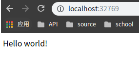

## docker常用命令速查
`sudo service docker start`    #docker启动 

`sudo service docker stop`    #docker关闭 

`sudo service docker restart` #docker重启 

`docker search ...` #从 Docker Hub 网站来搜索镜像（docker search httpd）

`docker pull ...`  #载入镜像 (docker pull ubuntu)

`docker ps` #列出当前所有正在运行的container

`docker ps -a` #列出所有的container

`docker ps -l`  #查询最后一次创建的container

`docker logs NAMES` #查看容器内的标准输出

`docker images` #查看本地所有镜像

`docker start [ID或者NAMES]` #启动一个容器

`docker stop [ID或者NAMES]` #停止一个容器


### ☆ docker.commit
`docker commit` #提交容器副本
```
docker commit -m="has update" -a="okaychen" [容器ID] okaychen/ubuntu:v2
```
> -m 提交的描述信息
> -a 指定镜像的作者
> [容器ID] 容器的ID
> okaychen/ubuntu:v2 指定要创建的目标镜像名

然后可以通过`docker run -i -t okaychen/ubuntu:v2 /bin/bash`来交互式的启动该镜像
### ☆ docker.run
`docker run ...` #启动容器（docker run -i -t ubuntu /bin/bash）
> -t 在新容器内制定一个终端或伪终端 
> -i 允许你对容器内的标准输入（STDIN）进行交互

就相当于启动了一个虚拟机，进入容器后可以尝试运行cat /proc/version 和ls分别查看系统的版本信息和当前目录下的文件列表
### ☆ docker.rm
> 先删除容器，然后删除镜像
> 删除前需要保证容器是停止的
> 删除镜像和删除容器的命令是不一样的。`docker rmi [ID]`,其中容器rm，镜像rmi 


### 组合操作
删除所有容器：`docker rm $(docker ps -aq)`
停用全部运行中容器：`docker stop $(docker ps -q)`、
❤ docker1.13版本之后：
删除所有孤立容器：`docker container prune`


### 运行一个web应用

`docker run -d -P training/webapp python app.py` # 运行一个web程序
> -d 让容器在后台运行
> -P 将容器内部使用的网络端口映射到我们的主机上


  
运行之后，docker ps查看，PROTS下面`0.0.0.0:32769->5000/tcp`多了端口信息，docker开放了5000端口（默认python flask端口）映射到主机端口32768上
我们就可以通过浏览器访问该web应用



通过-p参数来设置不同的端口
```
docker run -d -p 5000:5000 training/webapp python app.py
```
另外还可以
- 通过`docker port NAMESE`来查看制定容器的某个确定端口映射到宿主机的端口号
- 通过`docker logs [ID或者NAMSE]`可以查看容器内部的标准输出
- 通过`docker top [ID或者NAMESE]`来查看指定容器内部运行的进程
- 通过`docker inspect [ID或者NAMES]`来查看docker底层信息。它会返回一个json文件记录着docker容器的配置和状态信息


### 构建镜像
创建一个Dockerfile文件，使用`docker build`从零开始创建一个新的镜像
`docker build okaychen/centos"6.7 .`（`-t`:指定要创建的目标镜像名，`.`:Dockerfile文件所在的位置，可以指定Dockerfile文件的绝对路径），
```
FROM    centos:6.7
MAINTAINER      Fisher "okaychen@vip.qq.com"

RUN     /bin/echo 'root:123456' |chpasswd
RUN     useradd okaychen
RUN     /bin/echo 'okaychen:123456' |chpasswd
RUN     /bin/echo -e "LANG=\"en_US.UTF-8\"" >/etc/default/local
EXPOSE  22
EXPOSE  80
CMD     /usr/sbin/sshd -D
```
[简单Dockerfile构建镜像命令示例](./videos/test-2018-12-14_20.48.39.mp4)
